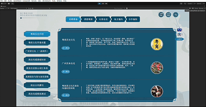
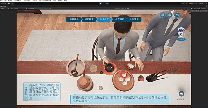
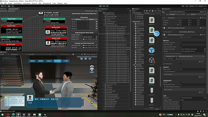

# 粤（えつ）商人茶文化インタラクティブ体験システム

## コアテクノロジー

本システムはUnityエンジンを基盤に、3言語動的ローカライゼーション、茶器物理インタラクション、茶席対話決定木の3大核心技術を通じて、没入型の粤商人茶文化体験プラットフォームを構築し、伝統的な茶芸のデジタル継承とインタラクティブな教育を実現します。

### 1. 3言語動的ローカライゼーションシステム

- **多言語インターフェース切替**：中国語、英語、粤語の3言語インターフェースをシームレスに切り替え可能
- **方言音声合成**：Azure音声サービスを統合し、広府、四邑、高陽等の地域発音に対応した粤語音声ガイドを生成
- **専門用語データベース**：「関公巡城」「韓信点兵」などの茶文化専門用語を正確に翻訳する多言語対照データベースを構築

### 2. 茶器物理インタラクション制御システム

- **インテリジェントハイライト表示**：Shader Graphを使用した発光輪郭シェーダーで、インタラクティブな茶杯に呼吸のようなハイライト効果を実現
- **精密動作認識**：距離検出アルゴリズムにより、急須と茶杯の位置関係を自動認識、注水動作をトリガーし次の操作を提示
- **マルチトラック同期制御**：Timelineトラック混合技術を採用し、UI表示、キャラクターアニメーションとカメラワークを統合的に調整

### 3. 茶席対話決定木エンジン

- **分岐ナラティブ対話**：決定木アーキテクチャを採用し、異なる選択が多様なストーリー展開を触发、キャラクターアイコンで没入感を強化
- **イベント連動機能**：対話ノードに多种の実行イベントを連動させ、ストーリーとインタラクションロジックを深く連携
- **自适应テキスト表示**：テキストの長さに応じてフォントサイズを自動調整し、内容が対話ボックス内に完全に表示されることを保証
